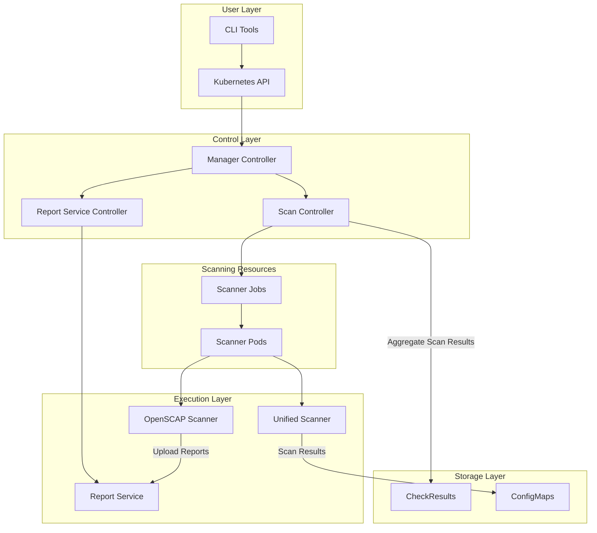
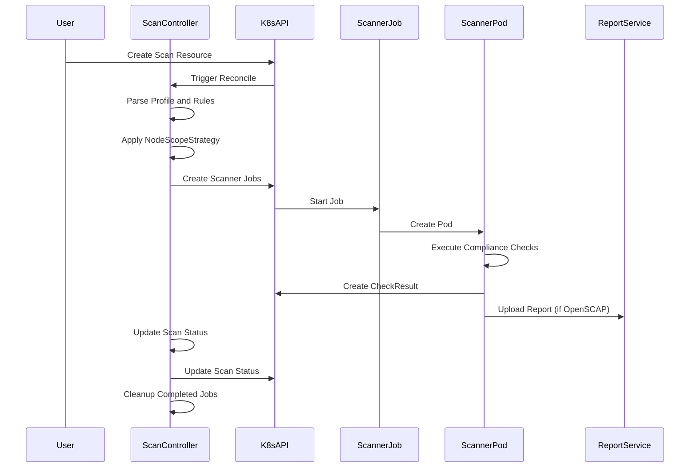

# Architecture

## Overview

Compliance Service is a Kubernetes-based compliance checking tool designed to simplify security compliance verification in Kubernetes environments. The project is inspired by the OpenShift compliance-operator design and supports DISA STIG standards and custom rule configuration.

## Architecture Diagram

## Architecture Layers

### User Layer
The user interaction layer provides multiple interfaces for accessing compliance services:
- **CLI Tools**: Command-line interface for direct interaction with compliance operations
- **Kubernetes API**: Standard Kubernetes API access for integration with existing workflows

### Control Layer
The control layer manages the orchestration and coordination of compliance operations:
- **Manager Controller**: Central controller that coordinates overall compliance service operations
- **Scan Controller**: Specialized controller responsible for managing compliance scanning workflows
- **Report Service Controller**: Manages report generation and distribution processes

### Execution Layer
The execution layer handles the actual compliance scanning and processing:
- **Unified Scanner**: Integrated scanner that handles multiple compliance frameworks
- **OpenSCAP Scanner**: Specialized scanner for OpenSCAP-based compliance checks
- **Report Service**: Service responsible for generating, storing, and serving compliance reports

### Storage Layer
The storage layer provides persistent and temporary storage for compliance data:
- **CheckResults (ETCD)**: Persistent storage for aggregated compliance check results
- **ConfigMaps**: Kubernetes-native storage for configuration data and scan results

### Scanning Resources
Dynamic resources created for executing compliance scans:
- **Scanner Jobs**: Kubernetes jobs that orchestrate compliance scanning tasks
- **Scanner Pods**: Individual pods that execute specific compliance checks

## Core Components

### Scan Controller
The Scan Controller is responsible for managing the complete lifecycle of compliance scanning tasks:

- **Scan Task Initialization and Scheduling**: Creates and schedules compliance scanning tasks based on configured policies
- **Scan Progress Tracking**: Monitors the execution status of ongoing compliance scans
- **Result Collection**: Aggregates and processes scanning results from multiple sources

### Report Service
The Report Service provides comprehensive report management capabilities:

- **Temporary Storage**: Provides secure temporary storage for OpenSCAP scan reports
- **Report Download**: Enables secure download and access to generated compliance reports
- **Report Generation**: Converts raw compliance data into formatted, actionable reports

## Data Flow

## Scan Execution Flow

The compliance scanning process follows a well-defined sequence that ensures proper resource management and result collection:

1. **Resource Creation**: The user creates a Scan custom resource through the Kubernetes API, which defines the scanning parameters, target nodes, and compliance profiles.

2. **Controller Reconciliation**: The ScanController detects the new Scan resource and begins the reconciliation process to orchestrate the scanning workflow.

3. **Configuration Processing**: The controller parses the specified compliance profiles and rules, then applies the NodeScopeStrategy to determine which nodes should be scanned based on the defined scope.

4. **Job Orchestration**: The controller creates Scanner Jobs for each target node, which will be responsible for executing the actual compliance checks.

5. **Pod Execution**: Each Scanner Job creates a Pod that runs the compliance scanning tools (such as OpenSCAP) on the target node.

6. **Compliance Assessment**: The Scanner Pod executes the compliance checks against the node, evaluating it against the specified security profiles and rules.

7. **Result Collection**: The Scanner Pod creates CheckResult resources in the Kubernetes API to store the compliance check outcomes.

8. **Report Generation**: For OpenSCAP-based scans, the Scanner Pod uploads detailed compliance reports to the ReportService for further analysis and storage.

9. **Status Management**: The ScanController continuously monitors the scanning progress and updates the Scan resource status to reflect the current state of the operation.

10. **Resource Cleanup**: Once scanning is complete, the controller cleans up the Scanner Jobs and Pods to free up cluster resources.

This architecture ensures that compliance scanning is distributed, scalable, and maintains proper separation of concerns between orchestration and execution components.
