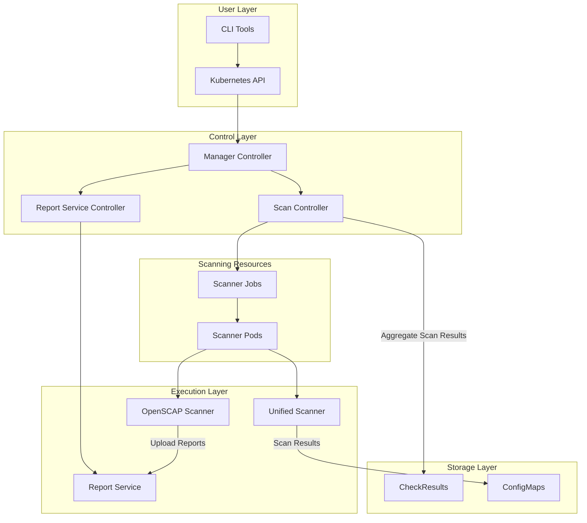

# Architecture

## Overview

Compliance Service is a Kubernetes-based compliance checking tool designed to simplify security compliance verification in Kubernetes environments. The project is inspired by the OpenShift compliance-operator design and supports DISA STIG standards and custom rule configuration.

## Architecture Diagram



## Architecture Layers

### User Layer
The user interaction layer provides multiple interfaces for accessing compliance services:
- **CLI Tools**: Command-line interface for direct interaction with compliance operations
- **Kubernetes API**: Standard Kubernetes API access for integration with existing workflows

### Control Layer
The control layer manages the orchestration and coordination of compliance operations:
- **Manager Controller**: Central controller that coordinates overall compliance service operations
- **Scan Controller**: Specialized controller responsible for managing compliance scanning workflows
- **Report Service Controller**: Manages report generation and distribution processes

### Execution Layer
The execution layer handles the actual compliance scanning and processing:
- **Unified Scanner**: Integrated scanner that handles multiple compliance frameworks
- **OpenSCAP Scanner**: Specialized scanner for OpenSCAP-based compliance checks
- **Report Service**: Service responsible for generating, storing, and serving compliance reports

### Storage Layer
The storage layer provides persistent and temporary storage for compliance data:
- **CheckResults (ETCD)**: Persistent storage for aggregated compliance check results
- **ConfigMaps**: Kubernetes-native storage for configuration data and scan results

### Scanning Resources
Dynamic resources created for executing compliance scans:
- **Scanner Jobs**: Kubernetes jobs that orchestrate compliance scanning tasks
- **Scanner Pods**: Individual pods that execute specific compliance checks

## Core Components

### Scan Controller
The Scan Controller is responsible for managing the complete lifecycle of compliance scanning tasks:

- **Scan Task Initialization and Scheduling**: Creates and schedules compliance scanning tasks based on configured policies
- **Scan Progress Tracking**: Monitors the execution status of ongoing compliance scans
- **Result Collection**: Aggregates and processes scanning results from multiple sources

### Report Service
The Report Service provides comprehensive report management capabilities:

- **Temporary Storage**: Provides secure temporary storage for OpenSCAP scan reports
- **Report Download**: Enables secure download and access to generated compliance reports
- **Report Generation**: Converts raw compliance data into formatted, actionable reports

## Data Flow

```mermaid
项目概述

Compliance Operator 是一个基于 Kubernetes 的合规性检查工具，旨在简化 Kubernetes 环境的安全合规检查。该项目参考 OpenShift compliance-operator 设计，支持 DISA STIG 标准、自定义规则配置。


功能
实现了 DISA STIG Kubernetes v2r2 合规标准
支持自定义规则和检查脚本
支持 YAML 配置 OpenSCAP XML 数据流文件
支持Micoos STIG合规检查
支持输出HTML报告


架构
graph TB
    subgraph "用户层"
        CLI[CLI Tools]
        K8S_API[Kubernetes API]
    end

    subgraph "控制层"
        MGR[Manager Controller]
        SCAN_CTRL[Scan Controller]
        REPORT_CTRL[Report Service Controller]
    end

    subgraph "执行层"
        UNIFIED[Unified Scanner]
        OPENSCAP[OpenSCAP Scanner]
        REPORT_SVC[Report Service]
    end

    subgraph "存储层"
        ETCD[CheckResults]
        CONFIG_MAP[ConfigMaps]
    end

    subgraph "扫描资源"
        JOBS[Scanner Jobs]
        PODS[Scanner Pods]
    end

    CLI --> K8S_API
    K8S_API --> MGR
    MGR --> SCAN_CTRL
    MGR --> REPORT_CTRL
    
    SCAN_CTRL --> JOBS
    JOBS --> PODS
    PODS --> UNIFIED
    PODS --> OPENSCAP
    
    REPORT_CTRL --> REPORT_SVC
    
    SCAN_CTRL -->|聚合扫描结果| ETCD
    UNIFIED -->|扫描结果| CONFIG_MAP
    OPENSCAP -->|上传报告| REPORT_SVC


核心组件
Scan Controller

负责管理合规扫描任务生命周期

扫描任务初始化和调度
扫描进度跟踪
收集扫描结果
Report Service

提供Openscap扫描报告的临时存储和下载


数据结构设计
Profile

定义合规配置文件，组件相关扫描规则。

apiVersion: compliance-operator.alauda.io/v1alpha1
kind: Profile
metadata:
  name: stig-k8s-v2r2-api-server
  namespace: compliance-system
spec:
  id: "STIG-K8S-V2R2-API-SERVER"										# XCCDF 配置文件标识符
  title: "STIG Kubernetes V2R2 API Server Security Profile"				# 合规配置标题
  description: |														# 合规配置描述
    This profile contains API server security checks based on the 
    Security Technical Implementation Guide (STIG) for Kubernetes V2R2.
    Focuses specifically on kube-apiserver configuration and security.
  version: "1.0"														# 版本号
  rules:																# 包含的规则列表
    - name: stig-k8s-api-server-alpha-apis-disabled
    - name: stig-k8s-api-server-anonymous-auth-disabled
    - name: stig-k8s-api-server-audit-log-enabled
    - name: stig-k8s-api-server-audit-log-maxage
    - name: stig-k8s-api-server-audit-log-maxbackup


Rule

定义具体的合规检查规则

apiVersion: compliance-operator.alauda.io/v1alpha1
kind: Rule
metadata:
  name: stig-k8s-api-server-audit-log-enabled
  namespace: compliance-system
spec:
  id: "V-242465"					# STIG规则ID
  title: "The Kubernetes API Server audit log path must be set."
  description: "Kubernetes API Server validates and configures pods and services for the API object. The REST operation provides frontend functionality to the cluster share state. Audit logs are necessary to provide evidence in the case the Kubernetes API Server is compromised requiring Cyber Security Investigation. To record events in the audit log the log path value must be set."
  checkText: "Change to the /etc/kubernetes/manifests/ directory on the Kubernetes Control Plane. Run the command:\ngrep -i audit-log-path * \n\nIf the setting audit-log-path is not set in the Kubernetes API Server manifest file or it is not set to a valid path, this is a finding."
  fixText: "Edit the Kubernetes API Server manifest file in the /etc/kubernetes/manifests directory on the Kubernetes Control Plane. Set the value of \"--audit-log-path\" to valid location."
  severity: "medium"
  checkType: "node"					# 检查类型：node
  nodeScope: "control-plane"		# 节点范围：all/control-plane/worker
  checkScript: |					# 检查脚本
    #!/bin/bash
    
    echo "Checking API Server audit log path configuration..."
    
    # Initialize variables
    result="PASSED"
    details=""
    manifest_file="/host/etc/kubernetes/manifests/kube-apiserver.yaml"

    echo "Checking API Server manifest: $manifest_file"

    # Check audit log path configuration
    if [[ -f "$manifest_file" ]]; then
        echo "Found API Server manifest file"
        
        # Extract audit log path from manifest
        audit_path=$(grep -i "\-\-audit-log-path" "$manifest_file" 2>/dev/null | awk -F'=' '{print $2}')
        
        if [[ -z "$audit_path" || "$audit_path" == "" ]]; then
            result="FAILED"
            details="audit-log-path not configured"
            echo "VIOLATION: audit-log-path parameter not found or empty"
        else
            echo "Found audit-log-path configuration: $audit_path"
            
            # Check if audit log directory exists (add /host prefix for host filesystem)
            audit_dir=$(dirname "$audit_path")
            host_audit_dir="/host$audit_dir"
            if [[ ! -d "$host_audit_dir" ]]; then
                result="FAILED"
                details="audit log directory does not exist: $audit_dir"
                echo "VIOLATION: audit log directory does not exist: $audit_dir"
            else
                echo "OK: audit log directory exists: $audit_dir"
            fi
        fi
    else
        result="FAILED"
        details="API Server manifest missing"
        echo "FAIL: API Server manifest file not found: $manifest_file"
    fi

    if [[ "$result" == "PASSED" ]]; then
        details="audit-log-path properly configured"
        echo "PASS: $details"
        exit 0
    else
        echo "FAIL: $details"
        exit 1
    fi 


自定义规则支持

apiVersion: compliance-operator.alauda.io/v1alpha1
kind: Rule
metadata:
  name: custom-security-check
spec:
  title: "自定义安全检查"
  checkType: "platform"
  checkScript: |
    #!/bin/bash
    # 自定义检查逻辑
    echo "检查通过"
	# 检查结果，0表示成功，1表示失败
    exit 0


Scan

定义扫描任务

apiVersion: compliance-operator.alauda.io/v1alpha1
kind: Scan
metadata:
  name: scan-stig-k8s-v2r2-api-server
  namespace: compliance-system
spec: 
  nodeScopeStrategy: auto		# 节点选择方式
  scanType: node				# 扫描类型
  targetNodeRoles:				# 节点范围
    - control-plane
    - worker
  profile: stig-k8s-v2r2-api-server		# 合规配置名
  nodeSelector: {}
  maxHistoricalResults: 3
  schedule: "0 2 * * *"


字段	类型	适用范围	描述	说明
spec.nodeScopeStrategy	string	k8s	

扫描节点扫描模式。支持 auto, manual

auto: 自动模式

根据 rule 中spec.nodeScope 自动匹配control-plane或worker节点。

manual: 手动模式

手动模式下，将忽略spec.nodeScope，scan中关联的profile所有 rules 都将在节点中扫描。

	

  auto策略: 所有nodeSelector匹配的节点 → 基于targetNodeRoles过滤 → 基于rule.nodeScope选择
  manual策略: 所有nodeSelector匹配的节点 → 基于targetNodeRoles过滤 → 应用到所有规则


spec.targetNodeRoles	array	k8s，os	

可选，限制节点角色。取值范围包括control-plane, worker。

当配置了该参数，将参与扫描节点过滤，与nodeScopeStrategy模式取交集。


spec.nodeSelector	array	

k8s，os

	

可选，使用节点选择。通过label选择节点。

当配置了该参数，将参与扫描节点过滤，与nodeScopeStrategy模式取交集。


spec.schedule	string	k8s，os	

可选，配置定制任务，使用cronjob语法。
例如 spec.schedule: "0 2 * * *" # 每天凌晨2点执行


	

spec.maxHistoricalResults	int	k8s，os	

可选，保留历史结果数量(默认5个)

例如 spec.maxHistoricalResults: 2


	


annotations	map	k8s，os	

compliance-operator.alauda.io/force-scan: "true"

手动触发立即开始扫描（扫描结束后会自动改为false）


	


k8s	

compliance-operator.alauda.io/job-mode: "aggregated"

聚合模式（串行扫描）开启 aggregated 模式后，Profile 中定义的所有规则会集中在单个 Scan Job 中执行，每个节点依次完成扫描。
注意：这个 annonation 标签仅对k8s扫描生效，OS扫描不存在批量创建job场景。

	


默认不带此annonation，该模式为并发扫描。

并发扫描场景下，scan controller会并行为每个rule创建一个job。随着节点数量增加，集群调度开销会增大。

CheckResult

存储扫描检查结果

type CheckResult struct {
    metav1.TypeMeta
    metav1.ObjectMeta
    Spec CheckResultSpec
}

type CheckResultSpec struct {
    ScanName     string       // 扫描名称
    ProfileName  string       // 配置文件名称
    RuleResults  []RuleResult // 规则检查结果
    Timestamp    metav1.Time  // 检查时间戳
}

type RuleResult struct {
    RuleID      string       // 规则ID
    RuleName    string       // 规则名称
    Severity    string       // 严重性
    CheckType   string       // 检查类型
    NodeScope   string       // 节点范围
    Status      string       // 检查状态
    Message     string       // 结果消息
}


检查结果状态定义
const (
    CheckResultStatusPass           = "PASS"
    CheckResultStatusFail           = "FAIL"
    CheckResultStatusManual         = "MANUAL"
    CheckResultStatusError          = "ERROR"
    CheckResultStatusInconsistent   = "INCONSISTENT"
    CheckResultStatusNotApplicable  = "NOT-APPLICABLE"
)
扫描执行流程


sequenceDiagram
    participant User
    participant ScanController
    participant K8sAPI
    participant ScannerJob
    participant ScannerPod
    participant ReportService

    User->>K8sAPI: 创建 Scan 资源
    K8sAPI->>ScanController: 触发 Reconcile
    ScanController->>ScanController: 解析 Profile 和 Rules
    ScanController->>ScanController: 应用 NodeScopeStrategy
    ScanController->>K8sAPI: 创建 Scanner Jobs
    K8sAPI->>ScannerJob: 启动 Job
    ScannerJob->>ScannerPod: 创建 Pod
    ScannerPod->>ScannerPod: 执行合规检查
    ScannerPod->>K8sAPI: 创建 CheckResult
    ScannerPod->>ReportService: 上传报告 (如果是 OpenSCAP)
    ScanController->>ScanController: 更新扫描状态
    ScanController->>K8sAPI: 更新 Scan Status
    ScanController->>ScanController: 清理完成的 Jobs
```
